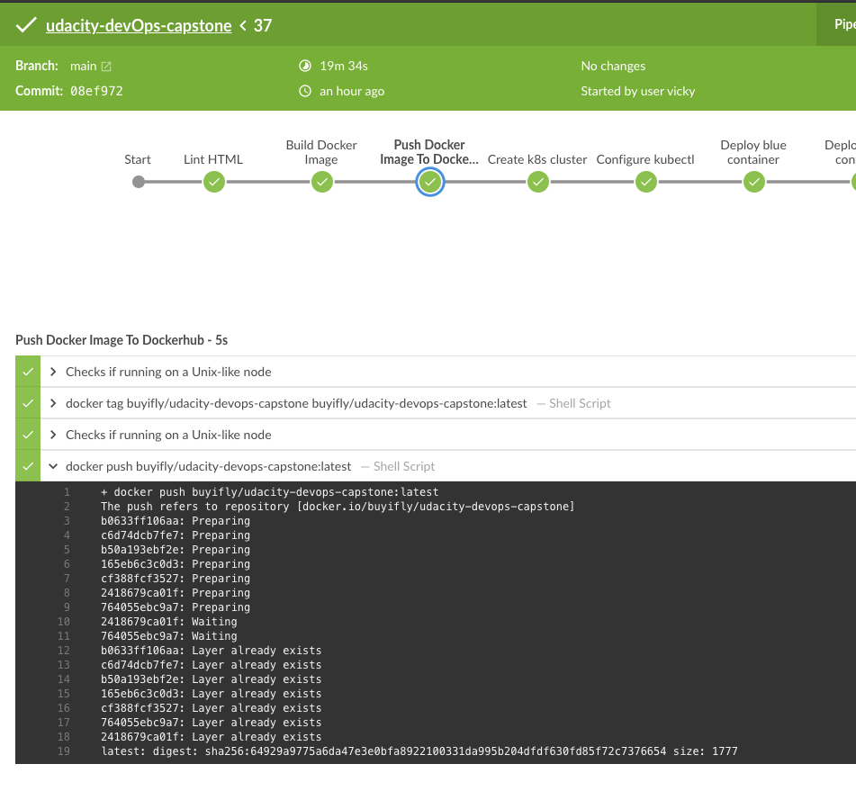
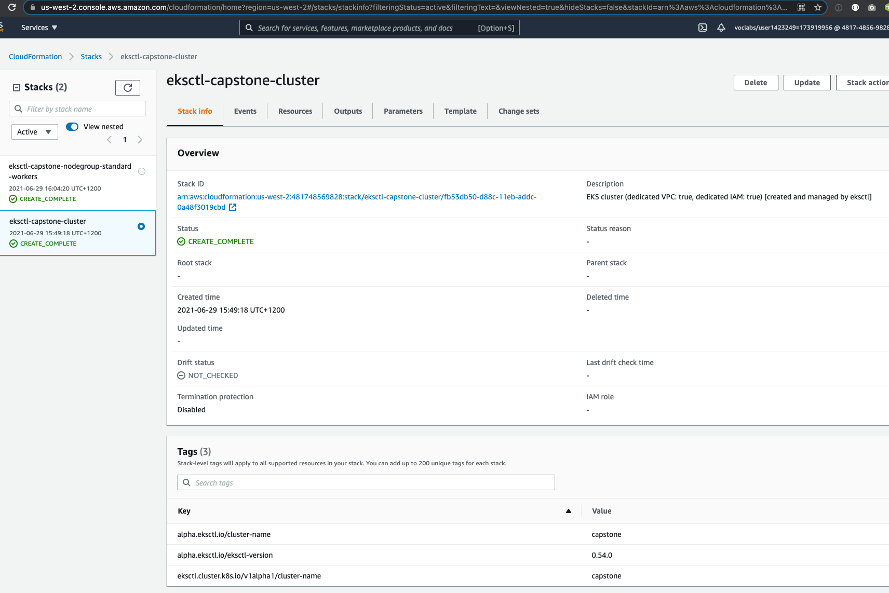

# Udacity-DevOps-Capstone

## Project Overview

Capstone project for Udacity's "Cloud DevOps Engineer" Nanodegree Program.

## Tools Used

- Git & GitHub
- AWS & AWS-CLI
- Ngnix
- Docker & Docker-Hub Registery
- Jenkins
- Kubernetes CLI (kubectl)
- EKS
- CloudFormation
- BASH

##Set Up Pipeline

##Use image repository to store Docker images

##Execute linting step in code pipeline

##Build a Docker container in a pipeline

##The Docker container is deployed to a Kubernetes cluster

##Use Blue/Green Deployment or a Rolling Deployment successfully

